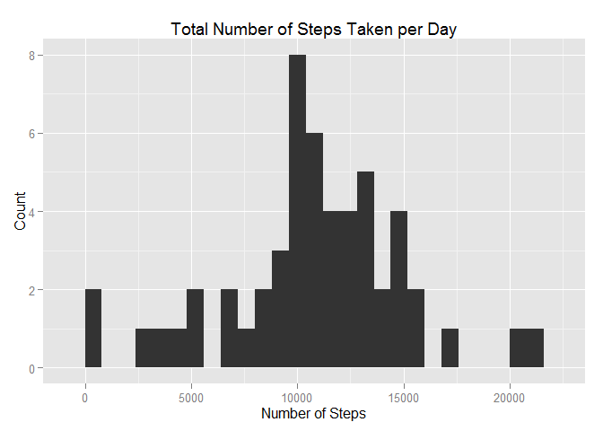
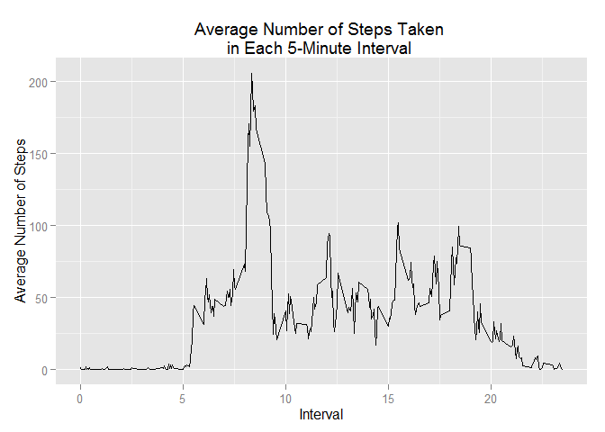
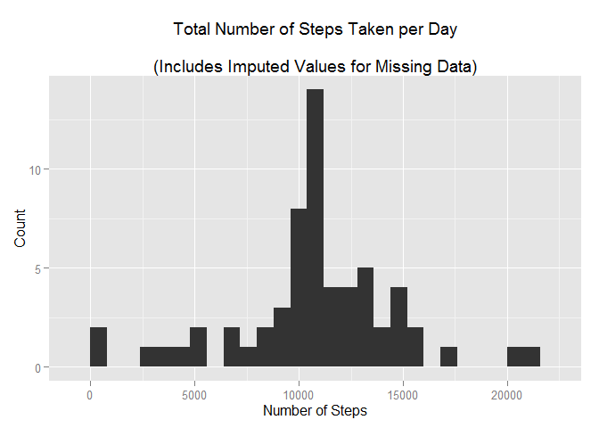
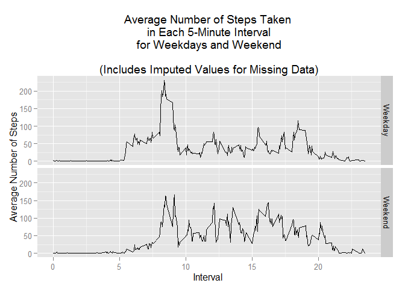

# Reproducible Research: Peer Assessment 1

## Introduction
This project analyses data from a personal activity monitoring device.  The data consists of 
two months of data from an anonymous individual.

The input dataset consists of a CSV file with the following columns:  
  - **steps:** Number of steps taken in a 5-minute interval.  
  - **date:** Date of measurement, in YYY-MM-DD format.  
  - **interval:** Identifies the 5-minute interval in which the measurement was taken.

## Loading and preprocessing the data


```r
# Read input data
indata <- read.csv("activity.csv")

# Convert the interval field into hours and minutes
indata$hours <- trunc( indata$interval/100)
indata$hm <-  indata$interval/100
indata$minutes <- round ( (indata$hm - indata$hours)*100)

# Create a subset excluding records with any missing data.
activity <- indata[complete.cases(indata), ]
```

## What is mean total number of steps taken per day?  

The **mean** total number of steps taken per day is **10,766.19**  
The **median** number of steps per day is **10,765**


```r
# Calculate the total number of steps
agg <- aggregate(activity$steps, activity['date'], sum)

library(ggplot2)

# Histogram of the total number of steps taken each day
qplot(x, data=agg, binwidth = 800,
      main= "Total Number of Steps Taken per Day",
      xlab= "Number of Steps",
      ylab= "Count")
```

 

```r
#calculate and print the mean steps taken per day
mean_daily_steps <- mean(agg$x)
mean_daily_steps
```

```
## [1] 10766.19
```

```r
# Calculate median steps per day
median_daily_steps <- median(agg$x)
median_daily_steps
```

```
## [1] 10765
```

## What is the average daily activity pattern?
The daily pattern is shown in the plot below.

On average, the greatest number of steps were taken during the **8:35** interval.
(This is consistent with the peak in the plot.)


```r
# Calculate mean number of steps in each 5-minute interval
agg2 <- aggregate(activity$steps, activity['hm'], mean)

#Create time series plot for mean number of steps by interval
qplot(hm, x, data=agg2, geom = "line",
      main= "Average Number of Steps Taken \nin Each 5-Minute Interval ",
      xlab= " Interval ",
      ylab= "Average Number of Steps")
```

 

```r
# find row containing interval with max mean number of steps
rm <- agg2[agg2$x == max(agg2$x) , ]
# Print interval (hh.mm) with maximum average number of steps across all days
rm$hm
```

```
## [1] 8.35
```

## Imputing missing values

**2304** records from the imported datasets had missing values (NAs) for the number of steps.
There were no missing values for the other two columns.

The **strategy** used to replace missing values for the number of steps was:  
1. The input dataset was merged with the data frame giving the mean number of steps for each interval.  
2. Missing values were replaced with the mean number of steps for that interval.

The summary function was then used to check if any missing values remained.  All missing values
were successfully replaced.

Using the dataset with missing values imputed,  
- The **mean** total number of steps is per day is **10,766.19** (same as before).  
- The **median** total number of steps per day is  **10,766.19** (slight increase).  
- The median and mean are now the same, whereas before there was a slight difference.


```r
#Print the number of rows having NAs for the number of steps
cat( "Number of rows with missing values is ", nrow(indata) - nrow( activity))
```

```
## Number of rows with missing values is  2304
```

```r
# Check which columns have missing values
summary(indata)
```

```
##      steps                date          interval          hours      
##  Min.   :  0.00   2012-10-01:  288   Min.   :   0.0   Min.   : 0.00  
##  1st Qu.:  0.00   2012-10-02:  288   1st Qu.: 588.8   1st Qu.: 5.75  
##  Median :  0.00   2012-10-03:  288   Median :1177.5   Median :11.50  
##  Mean   : 37.38   2012-10-04:  288   Mean   :1177.5   Mean   :11.50  
##  3rd Qu.: 12.00   2012-10-05:  288   3rd Qu.:1766.2   3rd Qu.:17.25  
##  Max.   :806.00   2012-10-06:  288   Max.   :2355.0   Max.   :23.00  
##  NA's   :2304     (Other)   :15840                                   
##        hm            minutes     
##  Min.   : 0.000   Min.   : 0.00  
##  1st Qu.: 5.888   1st Qu.:13.75  
##  Median :11.775   Median :27.50  
##  Mean   :11.775   Mean   :27.50  
##  3rd Qu.:17.663   3rd Qu.:41.25  
##  Max.   :23.550   Max.   :55.00  
## 
```

```r
# Merge imported dataframe with vector of mean steps for each interval,
# merging by interval, keeping all input rows,
# even if not matched (left join).
m <- merge(indata, agg2, all.indata = TRUE)

# Replace missing values for the number of steps with the
# mean number of steps for the interval
m$steps <- ifelse( is.na(m$steps), m$x, m$steps )
# Check whether there are still any missing values
summary(m$steps)
```

```
##    Min. 1st Qu.  Median    Mean 3rd Qu.    Max. 
##    0.00    0.00    0.00   37.38   27.00  806.00
```

```r
# Calculate the total number of steps each day,
# using dataset with missing data imputed
agg10 <- aggregate(m$steps, m['date'], sum)

# Histogram of the total number of steps taken each day, 
# with imputed values for missing data.
qplot(x, data=agg10, binwidth = 800,
      main= "Total Number of Steps Taken per Day
      \n(Includes Imputed Values for Missing Data)",
      xlab= "Number of Steps",
      ylab= "Count")
```

 

```r
#calculate and print the mean steps taken per day
mean_daily_steps <- mean(agg10$x)
mean_daily_steps
```

```
## [1] 10766.19
```

```r
# Calculate and print the median steps per day
median_daily_steps <- median(agg10$x)
median_daily_steps
```

```
## [1] 10766.19
```
## Are there differences in activity patterns between weekdays and weekends?
- The panel plot below shows that the activity patters are about the same for late night/early morning.
- From about 5:30 am to about 9:30 am there is grater activity during weekdays.
- From about 9:30 am until evening there is greater activity on weekends.


```r
m$act_date <- as.Date(m$date)
m$weekday <- weekdays(m$act_date)
m$weekend <- factor( ifelse(m$weekday %in% c("Saturday", "Sunday"), "Weekend", "Weekday") )

# Calculate mean number of steps in each 5-minute interval for weekdays and weekends
agg20 <- aggregate(m$steps, m[ c('weekend', 'hm')],  mean)

#Create panel plot for mean number of steps 
#by 5-minute interval and weekday/weekend
qplot(hm, x, data=agg20, geom = "line" , facets =  weekend~ .,
      main= "Average Number of Steps Taken \nin Each 5-Minute Interval\nfor Weekdays and Weekend
         \n(Includes Imputed Values for Missing Data)",
      xlab= "Interval ",
      ylab= "Average Number of Steps")
```

 

